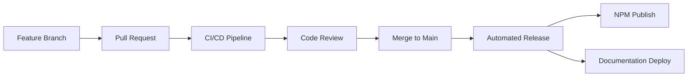

# Midas Design System - Technical Systems Documentation

## Table of Contents

1. [System Overview](#system-overview)
2. [Architecture](#architecture)
3. [Technology Stack](#technology-stack)
4. [Project Structure](#project-structure)
5. [Build System & Development Workflow](#build-system--development-workflow)
6. [Component Architecture](#component-architecture)
7. [Testing Strategy](#testing-strategy)
8. [Configuration Management](#configuration-management)
9. [Deployment & CI/CD](#deployment--cicd)
10. [Performance Considerations](#performance-considerations)
11. [Security Considerations](#security-considerations)
12. [Maintenance & Monitoring](#maintenance--monitoring)
13. [Contributing Guidelines](#contributing-guidelines)

## System Overview

Midas is Migrationsverket's (Swedish Migration Agency) design system, built as a modern React component library with comprehensive documentation. The system provides a unified set of accessible, reusable components and design tokens to ensure consistency across all digital products.

### Key Characteristics

- **Monorepo Architecture**: Multi-package repository managed with Nx
- **Component-First Design**: Reusable React components with accessibility built-in
- **Design Token System**: CSS custom properties for theming and consistency
- **Documentation-Driven**: Comprehensive Docusaurus-based documentation
- **Accessibility First**: Built on React Aria Components for WCAG compliance
- **TypeScript Native**: Full type safety across the entire system

## Architecture

### High-Level Architecture

```
┌─────────────────────────────────────────────────────────────┐
│                     Midas Design System                    │
├─────────────────────────────────────────────────────────────┤
│  Documentation Site (Docusaurus)                           │
│  ├─ Component Documentation                                │
│  ├─ Design Guidelines                                      │
│  ├─ API References                                         │
│  └─ Migration Guides                                       │
├─────────────────────────────────────────────────────────────┤
│  Component Library (@midas-ds/components)                  │
│  ├─ React Components                                       │
│  ├─ Design Tokens (CSS Custom Properties)                 │
│  ├─ Theme System                                           │
│  └─ Utility Functions                                      │
├─────────────────────────────────────────────────────────────┤
│  Development Tools                                         │
│  ├─ Storybook (Component Development)                      │
│  ├─ Playground (Testing Environment)                       │
│  ├─ Testing Infrastructure                                 │
│  └─ Build Tools (Vite, Nx)                                │
├─────────────────────────────────────────────────────────────┤
│  Foundation Layer                                          │
│  ├─ React Aria Components (Accessibility)                 │
│  ├─ React Stately (State Management)                      │
│  ├─ Lucide React (Icons)                                  │
│  └─ Inter Font (Typography)                               │
└─────────────────────────────────────────────────────────────┘
```

### Package Architecture

The system follows a modular architecture with clear separation of concerns:

- **Core Package** (`@midas-ds/components`): Main component library
- **Documentation** (`apps/docs`): Docusaurus-based documentation site
- **Development Tools** (`apps/playground`): Component testing and development
- **Build Infrastructure**: Nx workspace with shared tooling

## Technology Stack

### Core Technologies

| Technology                | Version | Purpose                                     |
| ------------------------- | ------- | ------------------------------------------- |
| **React**                 | ^18.3.1 | UI library foundation                       |
| **TypeScript**            | 5.8.3   | Type safety and developer experience        |
| **React Aria Components** | ^1.10.1 | Accessibility foundation                    |
| **React Stately**         | ^3.39.0 | State management for complex components     |
| **Vite**                  | ^5.2.12 | Build tool and dev server                   |
| **Nx**                    | ^20.5.0 | Monorepo management and build orchestration |

### Development & Build Tools

| Tool           | Purpose                            |
| -------------- | ---------------------------------- |
| **Storybook**  | Component development and testing  |
| **Jest**       | Unit testing framework             |
| **Cypress**    | End-to-end testing                 |
| **ESLint**     | Code linting and style enforcement |
| **Prettier**   | Code formatting                    |
| **Stylelint**  | CSS/SCSS linting                   |
| **Husky**      | Git hooks management               |
| **Commitizen** | Conventional commit enforcement    |

### Documentation & Design Tools

| Tool                        | Purpose                             |
| --------------------------- | ----------------------------------- |
| **Docusaurus**              | Documentation site generation       |
| **Chromatic**               | Visual regression testing           |
| **React Docgen TypeScript** | API documentation generation        |
| **Mermaid**                 | Diagram generation in documentation |

## Project Structure

```
midas/
├── apps/                           # Applications
│   ├── docs/                      # Docusaurus documentation site
│   │   ├── docs/                  # Documentation content
│   │   ├── blog/                  # Blog posts
│   │   ├── changelog/             # Release notes
│   │   └── src/                   # Custom React components
│   ├── playground/                # Component testing environment
│   └── playground-e2e/            # E2E tests for playground
├── packages/                      # Shared packages
│   └── components/                # Main component library
│       ├── src/                   # Component source code
│       │   ├── accordion/         # Component folders
│       │   ├── button/
│       │   ├── theme/            # Design tokens and theming
│       │   └── utils/            # Utility functions
│       ├── public/               # Static assets
│       └── tests/                # Component tests
├── tools/                        # Development tools and scripts
│   └── eslint/                   # Custom ESLint rules
├── .github/                      # GitHub workflows and templates
├── workspace-tools/              # Nx workspace tools
└── Configuration files           # Root-level config files
```

### Key Directories Explained

- **`apps/docs`**: Contains the Docusaurus documentation site with component examples, design guidelines, and API documentation
- **`packages/components`**: The core component library exported as `@midas-ds/components`
- **`tools/`**: Custom development tools, including ESLint rules specific to Midas
- **`.github/`**: CI/CD workflows for automated testing, building, and deployment

## Build System & Development Workflow

### Nx Workspace Configuration

The project uses Nx as the primary build orchestration tool, providing:

- **Task Caching**: Intelligent caching of build, test, and lint operations
- **Task Orchestration**: Parallel execution of tasks across packages
- **Dependency Graph**: Automatic detection of package dependencies
- **Code Generation**: Scaffolding tools for new components and applications

### Build Targets

Key build targets defined in `nx.json`:

```json
{
  "build": "Builds distributable packages",
  "test": "Runs unit tests with Jest",
  "lint": "Runs ESLint and Stylelint",
  "storybook": "Starts Storybook development server",
  "build-storybook": "Builds static Storybook",
  "e2e": "Runs end-to-end tests"
}
```

### Development Commands

```bash
# Install dependencies
npm install

# Start development servers
nx run docs:serve          # Documentation site
nx run playground:serve    # Component playground
nx run components:storybook # Storybook

# Build packages
nx run components:build    # Component library
nx run docs:build         # Documentation site

# Testing
nx run components:test     # Unit tests
nx run playground-e2e:e2e  # E2E tests
nx run components:test-storybook # Storybook tests

# Code quality
nx run-many --target=lint  # Lint all packages
nx run-many --target=test  # Test all packages
```

### Release Process

The project uses conventional commits and automated versioning:

1. **Commit Standards**: Conventional commits enforced via Commitizen
2. **Version Management**: Nx release tools for semantic versioning
3. **Changelog Generation**: Automatic changelog generation from commits
4. **Package Publishing**: Automated publishing to npm registry

## Component Architecture

### Design Principles

1. **Accessibility First**: All components built on React Aria Components
2. **Composability**: Components designed to work together seamlessly
3. **Customization**: Flexible theming through CSS custom properties
4. **Type Safety**: Full TypeScript support with comprehensive type definitions
5. **Performance**: Optimized bundle size and runtime performance

### Component Structure

Each component follows a consistent structure:

```
component-name/
├── index.ts                 # Public exports
├── ComponentName.tsx        # Main component implementation
├── ComponentName.module.css # Component-specific styles
├── ComponentName.test.tsx   # Unit tests
├── ComponentName.stories.tsx # Storybook stories
└── types.ts                 # TypeScript type definitions
```

### Component API Design

Components follow consistent API patterns:

```typescript
interface ComponentProps {
  // Core functionality props
  variant?: 'primary' | 'secondary' | 'tertiary'
  size?: 'small' | 'medium' | 'large'

  // State props
  isDisabled?: boolean
  isLoading?: boolean

  // Event handlers
  onPress?: (e: PressEvent) => void

  // Accessibility props
  'aria-label'?: string
  'aria-describedby'?: string

  // Styling props
  className?: string

  // Children for composable components
  children?: React.ReactNode
}
```

### Theme System

The theme system is built on CSS custom properties, providing:

- **Design Tokens**: Semantic naming for colors, spacing, typography
- **Dark Mode Support**: Automatic theme switching
- **Customization**: Easy overriding of design tokens
- **Consistency**: Centralized design decisions

#### Color System

The design system includes a comprehensive color palette:

```typescript
// Base colors (from tokens.ts)
export const baseColors = {
  // Grayscale
  black: '#000',
  white: '#fff',
  gray10: '#f2f2f2',
  gray20: '#e6e6e6',
  // ... (20-step grayscale)
  gray200: '#171717',

  // Brand colors
  blue10: '#eaf2f6',
  blue100: '#2e7ca5',
  blue150: '#143c50',

  // Signal colors
  signalBlue100: '#06c',
  signalGreen20: '#d5f2d9',
  red100: '#b90835',
  purple110: '#954b95',
}
```

#### CSS Custom Properties

```css
:root {
  /* Semantic colors */
  --semantic-text-primary: var(--color-neutral-900);
  --semantic-background-primary: var(--color-neutral-50);

  /* Component-specific tokens */
  --button-background-primary: var(--semantic-background-primary);
  --button-text-primary: var(--semantic-text-primary);

  /* Spacing scale */
  --spacing-xs: 0.25rem;
  --spacing-sm: 0.5rem;
  --spacing-md: 1rem;
}
```

#### Theme Files Structure

- **`global.css`**: Global styles and font imports (Inter font)
- **`theme.css`**: Core theme variables and design tokens
- **`tokens.css`**: CSS custom properties generated from TypeScript tokens
- **`tokens.ts`**: TypeScript source of truth for design tokens

## Testing Strategy

### Multi-Level Testing Approach

1. **Unit Tests** (Jest + Testing Library)
   - Component behavior testing
   - Accessibility testing with jest-axe
   - Type checking with TypeScript

2. **Visual Regression Tests** (Chromatic)
   - Automated visual testing of components
   - Cross-browser compatibility
   - Design review workflow

3. **Integration Tests** (Storybook Test Runner)
   - Component interaction testing
   - Story-based testing approach
   - Accessibility validation

4. **End-to-End Tests** (Cypress)
   - Full user workflow testing
   - Real browser environment testing
   - Performance monitoring

### Testing Standards

```typescript
// Example component test structure
describe('Button Component', () => {
  it('renders with correct text', () => {
    render(<Button>Click me</Button>)
    expect(screen.getByRole('button')).toHaveTextContent('Click me')
  })

  it('is accessible', async () => {
    const { container } = render(<Button>Accessible button</Button>)
    const results = await axe(container)
    expect(results).toHaveNoViolations()
  })

  it('handles press events', () => {
    const onPress = jest.fn()
    render(<Button onPress={onPress}>Press me</Button>)
    fireEvent.click(screen.getByRole('button'))
    expect(onPress).toHaveBeenCalledTimes(1)
  })
})
```

## Configuration Management

### Environment Configuration

The system supports multiple environments through configuration files:

- **Development**: Local development with hot reloading
- **Staging**: Pre-production testing environment
- **Production**: Live documentation and component library

### Build Configuration

Key configuration files:

- **`nx.json`**: Nx workspace configuration and task definitions
- **`vite.config.ts`**: Build tool configuration for components
- **`jest.config.ts`**: Testing framework configuration
- **`docusaurus.config.ts`**: Documentation site configuration
- **`.eslintrc.json`**: Code linting rules and standards

### Environment Variables

```bash
# Documentation deployment
GITHUB_REF_NAME=dev          # Branch-based deployment
PR_NUMBER=123               # PR preview deployment

# Build optimization
NODE_ENV=production         # Production optimizations
CHROMATIC_PROJECT_TOKEN=*** # Visual testing integration
```

## Deployment & CI/CD

### GitHub Actions Workflows

The project uses GitHub Actions for automated CI/CD:

1. **`components-ci.yml`**: Component library testing and building
   - Runs on PR to dev/main/release branches
   - Executes lint, stylelint, test, and build tasks
   - Uses Node.js version from .nvmrc file
   - Leverages Nx for efficient task execution

2. **`documentation-ci.yml`**: Documentation site deployment
   - Deploys to GitHub Pages
   - Builds Docusaurus documentation site
   - Handles branch-specific deployments

3. **`chromatic.yml`**: Visual regression testing
   - Automated visual testing with Chromatic
   - Cross-browser compatibility checks
   - Design review workflow integration

4. **`test-storybook.yml`**: Storybook component testing
   - Runs interaction tests on Storybook stories
   - Validates component behavior and accessibility

5. **`dependency-review.yml`**: Security scanning
   - Automated dependency vulnerability scanning
   - License compliance checking

6. **`release.yml`**: Automated release process
   - Semantic versioning based on conventional commits
   - Automated changelog generation
   - Package publishing to npm

7. **`publish.yml`**: Package publication
   - Automated npm package publishing
   - Distribution to npm registry

### Deployment Strategy

- **Documentation Site**: Deployed to GitHub Pages with branch-based environments
- **Component Library**: Published to npm registry with semantic versioning
- **Storybook**: Deployed to Chromatic for design review and testing

### Release Workflow



## Performance Considerations

### Bundle Optimization

- **Tree Shaking**: Dead code elimination in production builds
- **Code Splitting**: Lazy loading of component modules
- **Asset Optimization**: Optimized images and fonts
- **CSS Optimization**: Minimal CSS bundle with CSS modules

### Runtime Performance

- **React Optimization**: Proper use of React.memo and useMemo
- **Accessibility Performance**: Optimized screen reader experience
- **Animation Performance**: CSS-based animations for smooth interactions
- **Bundle Size Monitoring**: Continuous monitoring of package size

### Metrics and Monitoring

- **Bundle Analyzer**: Regular analysis of bundle composition
- **Performance Budget**: Defined limits for bundle sizes
- **Core Web Vitals**: Monitoring of documentation site performance

## Security Considerations

### Dependency Management

- **Automated Updates**: Dependabot for security vulnerability patching
- **Audit Scanning**: Regular npm audit scans
- **License Compliance**: CC0-1.0 license for open source compliance

### Code Security

- **Input Sanitization**: Proper handling of user inputs in components
- **XSS Prevention**: Secure rendering of dynamic content
- **CSP Headers**: Content Security Policy for documentation site

### Access Control

- **Repository Security**: Protected main branch with required reviews
- **Package Publishing**: Secure npm publishing with 2FA
- **Secrets Management**: Secure handling of API keys and tokens

## Maintenance & Monitoring

### Health Monitoring

- **Build Status**: Continuous monitoring of build pipeline health
- **Test Coverage**: Maintaining high test coverage standards
- **Dependency Health**: Regular updates and security patches

### Documentation Maintenance

- **API Documentation**: Automated generation from TypeScript types
- **Component Examples**: Live examples with source code
- **Migration Guides**: Comprehensive upgrade documentation

### Community Support

- **Issue Tracking**: GitHub Issues for bug reports and feature requests
- **Contributing Guidelines**: Clear documentation for contributors
- **Release Communication**: Regular release notes and announcements

## Contributing Guidelines

### Development Setup

1. **Prerequisites**: Node.js 22+, npm
2. **Installation**: Clone repository and run `npm install`
3. **Development**: Start development servers with Nx commands

### Code Standards

- **TypeScript**: Strict mode enabled with comprehensive type checking
- **ESLint**: Custom rules for Midas-specific patterns
- **Prettier**: Automated code formatting
- **Conventional Commits**: Standardized commit message format

### Component Development Process

1. **Design Review**: Collaborate with design team on component specifications
2. **Implementation**: Build component with accessibility and tests
3. **Documentation**: Create comprehensive documentation and examples
4. **Review**: Code review with focus on accessibility and performance
5. **Testing**: Comprehensive testing across multiple browsers and devices

### Pull Request Guidelines

- **Branch Naming**: `feature/component-name` or `fix/issue-description`
- **Commit Messages**: Follow conventional commit standards
- **Testing**: All tests must pass including accessibility checks
- **Documentation**: Update relevant documentation
- **Review Process**: Require approval from code owners

---

## Additional Resources

- **Repository**: [GitHub - migrationsverket/midas](https://github.com/migrationsverket/midas)
- **Documentation**: [Midas Design System](https://designsystem.migrationsverket.se)
- **NPM Package**: [@midas-ds/components](https://www.npmjs.com/package/@midas-ds/components)
- **Storybook**: Component development environment
- **Issues**: [GitHub Issues](https://github.com/migrationsverket/midas/issues)

This technical documentation serves as a comprehensive guide for developers, DevOps engineers, and technical stakeholders working with the Midas Design System. For user-facing documentation and component usage examples, please refer to the main documentation site.
